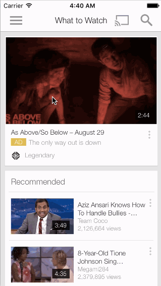

# youtube

Week 4 CodePath Lab

he goal of this week's lab is to implement custom navigation beyond the standard tab and navigation controllers. 

This lab specifically includes hamburger navigation.

Time spent: #4 hours

#Lab Requirements
Milestones 1-5 completed, plus...
6. Bonus: Menu scaling

#Demo GIF

#License
Licensed under the Apache License, Version 2.0 (the "License"); you may not use this file except in compliance with the License.

You may obtain a copy of the License at: http://www.apache.org/licenses/LICENSE-2.0

Unless required by applicable law or agreed to in writing, software distributed under the License is distributed on an "AS IS" BASIS, WITHOUT WARRANTIES OR CONDITIONS OF ANY KIND, either express or implied.
